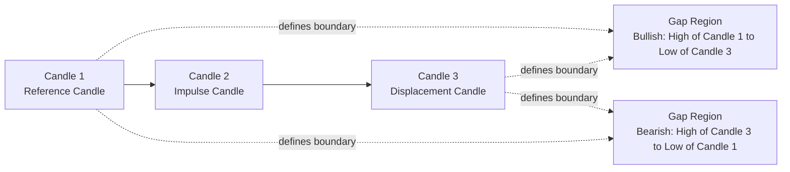

# Fair Value Gap (FVG) Strategy Evaluation Report

## 1. Introduction

Financial markets are not perfectly efficient at all times. Short-lived imbalances between buying and selling pressure can create price dislocations, where the market moves quickly and leaves zones with low two-sided trading activity.

This document evaluates a Fair Value Gap (FVG)-based trading approach on NEPSE equities data using a rule-based, reproducible workflow.

FVGs are relevant in modern trading because they provide:

- A structured way to detect potential imbalance zones.
- A context-aware entry framework (re-entry into imbalance region).
- A measurable setup for forward performance testing.

Objective:

- Evaluate performance of an FVG-based strategy.
- Identify strengths, weaknesses, and practical usability.

## 2. Dataset Description

### 2.1 Data Source

- Source format: CSV files containing OHLC time-series data.
- Market universe: NEPSE equities across 13 sector files in `data/`.

### 2.2 Data Structure

Core columns used in analysis:

- Open
- High
- Low
- Close
- Date
- Symbol
- Sector (derived from CSV filename)

### 2.3 Data Characteristics

- Timeframe: Daily candles.
- Frequency check: median gap between observations = 1 day (mode = 1 day).
- Total rows analyzed: 15,053
- Number of symbols: 13
- Number of sectors: 13
- Date range: 2021-03-31 to 2026-03-30

Data cleaning and preprocessing:

- Concatenate all sector CSVs.
- Parse `Date` with coercion and drop invalid dates.
- Convert `Open/High/Low/Close` to numeric with coercion.
- Drop rows with missing essential fields.
- Sort by `Symbol, Date` before signal generation.

## 3. Fair Value Gap (FVG) Concept

### 3.1 Definition

An FVG is a three-candle imbalance where price displacement leaves a gap between the first and third candles (with the middle candle representing impulse continuation). It suggests potential inefficiency that price may later revisit.

Gaps occur due to aggressive directional order flow, thin liquidity pockets, and rapid repricing.

### 3.2 Bullish FVG

Formation logic at index `i`:

- `Low[i] > High[i-2]`

Interpretation:

- Price moved up aggressively, leaving an untraded zone below current price.
- Expected behavior: price may retrace into this zone before continuation.

### 3.3 Bearish FVG

Formation logic at index `i`:

- `High[i] < Low[i-2]`

Interpretation:

- Price moved down aggressively, leaving an untraded zone above current price.
- Expected behavior: price may rally back into this zone before downside continuation.

### 3.4 Visual Illustration

Diagram note:

- Candle 1 and Candle 3 define the imbalance boundaries.
- Candle 2 captures displacement momentum.
- The gap region is the candidate area for later re-entry.

## 4. Custom FVG Indicator

### 4.1 Indicator Logic

FVG zones are detected with a 3-candle structure and filtered by minimum size:

- Minimum gap threshold: 0.5% of reference price.

Gap boundaries:

- Bullish FVG zone: `Gap_Low = High[i-2]`, `Gap_High = Low[i]`
- Bearish FVG zone: `Gap_Low = High[i]`, `Gap_High = Low[i-2]`

Type classification:

- `Bullish` if upward imbalance condition holds.
- `Bearish` if downward imbalance condition holds.

### 4.2 Implementation Overview

Algorithm workflow:

1. Identify valid 3-candle FVG structures per symbol.
2. Compute gap size and percentage.
3. Keep only gaps passing threshold.
4. De-duplicate continuous same-type, consecutive-bar FVG clusters by retaining the largest `Gap_Size`.
5. Store signal metadata (`Symbol`, `Date`, `Type`, `Gap_Low`, `Gap_High`, `Gap_Size`, `Gap_Pct`, `Bar_Index`).

### 4.3 Signal Generation

Valid signal requirements:

- Meets bullish/bearish 3-candle condition.
- Gap size percentage >= 0.5%.
- Survives continuous-group de-duplication.

Handling overlapping or invalid gaps:

- Overlapping continuous signals are reduced to one strongest signal in each continuous run.
- Signals without future re-entry are not used for trade entry/performance rows.

## 5. Entry Strategy (Re-entry Logic)

### 5.1 Concept

Instead of entering immediately at signal formation, strategy waits for price to revisit the FVG zone. This seeks improved location and avoids chasing displacement candles.

### 5.2 Entry Conditions

- Search candles after signal candle.
- Re-entry is valid when candle range overlaps FVG zone:
  - `Low <= Gap_High` and `High >= Gap_Low`
- First valid overlap candle is selected as the entry candle.

### 5.3 Entry Price Definition

- Entry price = `Close` of the first re-entry candle.

### 5.4 Example

| Signal Date | FVG Type | Gap Low | Gap High | First Re-entry Date | Entry Price Rule         |
| ----------- | -------- | ------: | -------: | ------------------- | ------------------------ |
| 2025-01-15  | Bullish  |  410.20 |   419.80 | 2025-01-18          | Close of re-entry candle |

## 6. Performance Metrics

### 6.1 Return (%)

- Bullish: `((Future_Close - Entry_Price) / Entry_Price) * 100`
- Bearish: `((Entry_Price - Future_Close) / Entry_Price) * 100`

Interpretation: directional trade outcome at chosen horizon.

### 6.2 Win Rate (%)

- Winning trade: `Return_Pct > 0`
- Win Rate: percentage of winning trades in group.

### 6.3 Maximum Favorable Excursion (MFE)

- Bullish: `((max(High path) - Entry_Price) / Entry_Price) * 100`
- Bearish: `((Entry_Price - min(Low path)) / Entry_Price) * 100`

Importance: captures best achievable unrealized move within horizon.

### 6.4 Maximum Adverse Excursion (MAE)

- Bullish: `((min(Low path) - Entry_Price) / Entry_Price) * 100`
- Bearish: `((Entry_Price - max(High path)) / Entry_Price) * 100`

Interpretation: adverse move and drawdown pressure after entry.

### 6.5 Risk-Reward Ratio (RR)

- `RR = MFE / abs(MAE)` when `MAE < 0`; otherwise undefined (`NaN`).

Meaning: expected favorable move relative to adverse excursion.

## 7. Analysis Methodology

### 7.1 Horizons

Forward evaluation periods:

- 3 candles
- 5 candles
- 10 candles
- 15 candles
- 20 candles

### 7.2 Evaluation Process

- Detect FVG signal.
- Wait for first valid re-entry.
- Set entry price at re-entry close.
- Track forward candles by each horizon.
- Compute Return, Win, MFE, MAE, and RR.

### 7.3 Data Aggregation

Results grouped by:

- Horizon
- FVG Type
- Sector

## 8. Results & Findings

Summary counts from current run:

- FVG signals (post-threshold and de-dup): 2,114
- Signals with valid re-entry: 2,049
- Signals contributing to at least one horizon metric: 2,041
- Total performance rows across horizons: 10,134

### 8.1 Overall Performance by Horizon

| Horizon | Signals | Avg Return (%) | Win Rate (%) | MFE (%) | MAE (%) |     RR |
| ------: | ------: | -------------: | -----------: | ------: | ------: | -----: |
|       3 |    2041 |          0.263 |       52.376 |   2.691 |  -2.331 | 12.208 |
|       5 |    2037 |          0.263 |       49.730 |   3.559 |  -3.110 | 11.654 |
|      10 |    2030 |          0.246 |       49.409 |   5.250 |  -4.603 | 12.843 |
|      15 |    2017 |          0.100 |       49.132 |   6.404 |  -5.838 | 12.278 |
|      20 |    2009 |         -0.208 |       49.477 |   7.319 |  -6.913 | 11.965 |

(Insert chart visualization here)

### 8.2 Bullish vs Bearish Performance

| Type    | Horizon | Signals | Avg Return (%) | Win Rate (%) |     RR |
| ------- | ------: | ------: | -------------: | -----------: | -----: |
| Bearish |       3 |     978 |          0.383 |       60.941 |  8.277 |
| Bearish |       5 |     978 |          0.199 |       56.033 |  8.738 |
| Bearish |      10 |     975 |         -0.181 |       53.744 |  8.223 |
| Bearish |      15 |     970 |         -0.429 |       53.299 |  9.405 |
| Bearish |      20 |     966 |         -0.812 |       53.209 |  9.701 |
| Bullish |       3 |    1063 |          0.152 |       44.497 | 15.953 |
| Bullish |       5 |    1059 |          0.322 |       43.909 | 14.415 |
| Bullish |      10 |    1055 |          0.640 |       45.403 | 17.218 |
| Bullish |      15 |    1047 |          0.590 |       45.272 | 15.006 |
| Bullish |      20 |    1043 |          0.352 |       46.021 | 14.107 |

(Insert comparison chart here)

### 8.3 Sector-wise Performance (Optional)

Top sector/type/horizon slices by average return (minimum 50 signals):

| Sector  | Type    | Horizon | Signals | Avg Return (%) | Win Rate (%) |
| ------- | ------- | ------: | ------: | -------------: | -----------: |
| Hotel   | Bullish |      20 |      75 |          4.041 |       54.667 |
| Hotel   | Bullish |      15 |      76 |          2.837 |       48.684 |
| Finance | Bullish |      15 |      95 |          2.381 |       53.684 |
| Hotel   | Bullish |      10 |      77 |          2.370 |       49.351 |
| Finance | Bullish |      10 |      96 |          2.151 |       56.250 |
| Finance | Bullish |      20 |      95 |          2.036 |       54.737 |
| DevBank | Bullish |      15 |     100 |          1.883 |       52.000 |
| DevBank | Bullish |      10 |     100 |          1.734 |       50.000 |
| Others  | Bullish |      20 |      63 |          1.732 |       52.381 |
| DevBank | Bullish |      20 |      99 |          1.584 |       53.535 |

(Insert visualization here)

## 9. Key Insights

- Best-performing horizon by average return (overall): 3 candles (0.263%), tied with 5 candles at 0.263%.
- Best horizon by win rate: 3 candles (52.376%).
- Bearish setups show stronger win rates (53-61%) but returns degrade and become negative at longer horizons.
- Bullish setups show lower win rates (44-46%) but stronger positive expectancy at medium/long horizons (10-20 candles).
- MFE grows with horizon, but MAE also deepens; risk rises as holding period increases.
- The broad edge is modest overall and appears more tactical in shorter horizons.

## 10. Limitations

- Entry/exit assumptions are simplified (close-based entry on first touch, fixed horizon exits).
- Transaction costs, slippage, and liquidity impact are not included.
- No regime filter (trend/volatility/market state) is applied.
- Corporate actions and survivorship treatment are not explicitly modeled in this report.
- RR may be inflated in cases where MAE is very small in magnitude.

## 11. Conclusion

The tested FVG re-entry strategy shows a measurable but modest edge in this NEPSE sample, especially in short holding horizons. The signal framework is usable as a structured component in discretionary or systematic workflows, but it should not be deployed standalone without risk controls, cost modeling, and market-regime filters.

Practical usability verdict:

- Useful as a directional context and timing module.
- Better suited as part of a multi-factor strategy than as a single-factor system.
